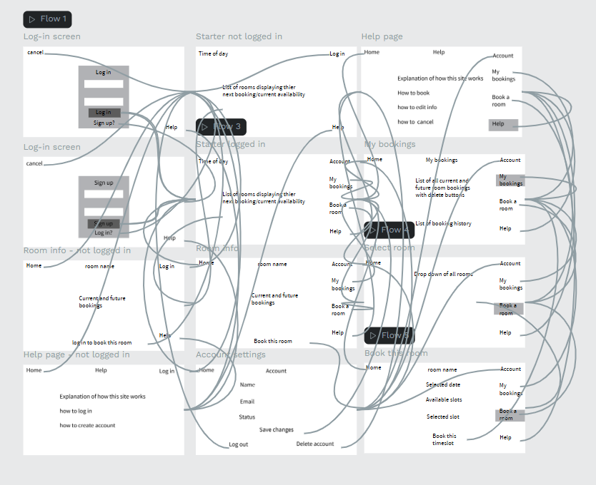
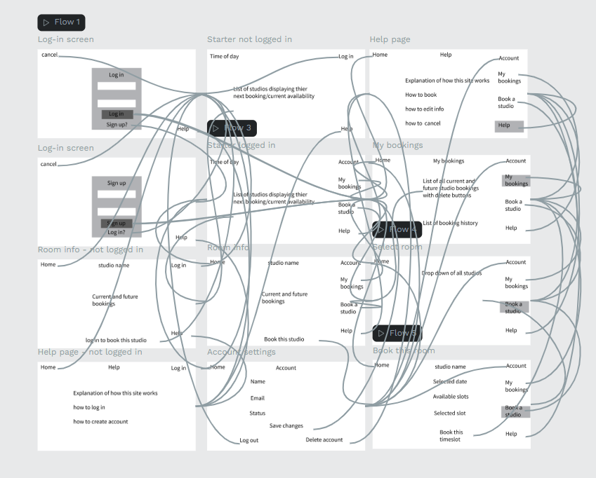
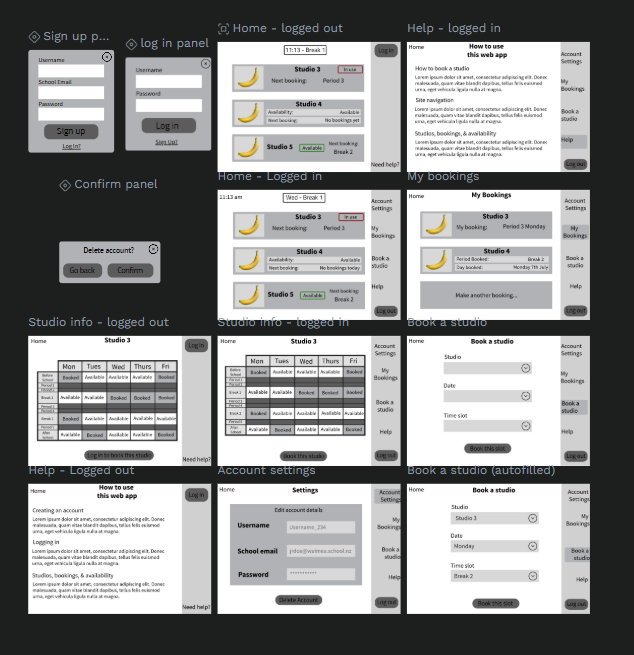

# Sprint 1 - Developing a DB and UI Prototype

## Sprint Goals

Develop a design for the database and a UI prototype that simulates the key functionality of the system. Test and refine the UI so that it can serve as the model for the next phase of development in Sprint 2.

### Specific Goals

**Edit these goals as needed**

- Design the database:
    - Tables
    - Fields / types
    - Primary keys
    - Default / nullable values
    - Relationships (foreign keys)
- Design the UI
    - Key pages
    - User interactions and 'flow'
    - Page layouts / features
    - Colour palette
    - Etc.

## Initial Database Design

Replace this text with notes regarding the DB design.

### Required Data Input

Replace this text with a description of what data will be input, and where / how it will be obtained.

### Required Data Output

Replace this text with a description of the outputs for the system - what types of data will be displayed?

### Required Data Processing

Replace this text with a description of how the data will be processed to achieve the desired output(s) - any processes / formulae?

## UI 'Flow'

The first stage of prototyping was to explore how the UI might 'flow' between states, based on the required functionality.

This Penpot demo shows the initial design for the UI 'flow':

https://design.penpot.app/#/view?file-id=f0485fb1-4e63-8165-8008-3908162e8168&page-id=f0485fb1-4e63-8165-8008-3908162e8169&section=interactions&index=0&share-id=6956fb43-d0b4-807f-8008-4224ada5fb9a

### Testing

To test this flow i sent it to my end users to test and give feedback on.

My first end user, the staff member, was happy with the flow of the ui and had no issues. She requested I replace the word room with studio for clarity.

My second end user, a music student, said "a way to access the individual room information through the 'My bookings' tab would be lovely."

My third end user, another music student, was satisfied with the flow, but requested that after a user logs in, the app redirects to the "My bookings" tab instead of the home screen.

### Changes / Improvements

Added requested features.

https://design.penpot.app/#/view?file-id=a1a9e568-e174-80fb-8008-5d1c38774a33&page-id=f0485fb1-4e63-8165-8008-3908162e8169&section=interactions&index=0&share-id=64054412-1123-81ed-8008-5d1cdea754d8

## Initial UI Prototype

The next stage of prototyping was to develop the layout for each screen of the UI.

This Penpot demo shows the initial layout design for the UI:

https://design.penpot.app/#/view?file-id=a1a9e568-e174-80fb-8008-5d1d16285281&page-id=a1a9e568-e174-80fb-8008-5d1d16285282&section=interactions&index=0&share-id=81f57451-85cc-819d-8008-7823d583471e

### Testing

Replace this text with notes about what you did to test the UI flow and the outcome of the testing.

### Changes / Improvements

Replace this text with notes any improvements you made as a result of the testing.

*FIGMA IMPROVED PROTOTYPE - PLACE THE FIGMA EMBED CODE HERE - MAKE SURE IT IS SET SO THAT EVERYONE CAN ACCESS IT*

## Refined UI Prototype

Having established the layout of the UI screens, the prototype was refined visually, in terms of colour, fonts, etc.

This Figma demo shows the UI with refinements applied:

*FIGMA REFINED PROTOTYPE - PLACE THE FIGMA EMBED CODE HERE - MAKE SURE IT IS SET SO THAT EVERYONE CAN ACCESS IT*

### Testing

Replace this text with notes about what you did to test the UI flow and the outcome of the testing.

### Changes / Improvements

Replace this text with notes any improvements you made as a result of the testing.

*FIGMA IMPROVED REFINED PROTOTYPE - PLACE THE FIGMA EMBED CODE HERE - MAKE SURE IT IS SET SO THAT EVERYONE CAN ACCESS IT*

## Sprint Review

Replace this text with a statement about how the sprint has moved the project forward - key success point, any things that didn't go so well, etc.

